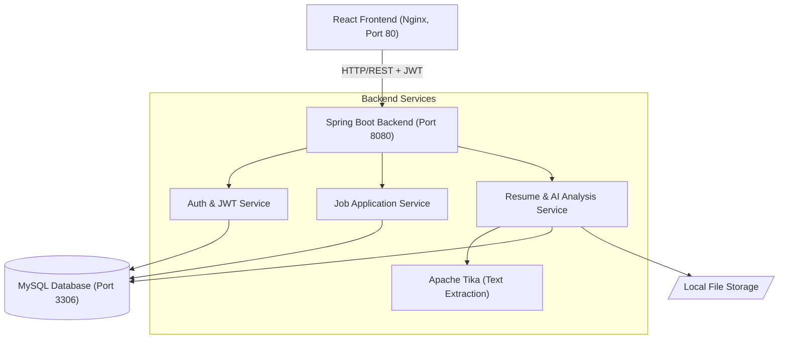

# AI Job Application Tracker

A production-ready full-stack application to track job applications, manage resumes, and provide AI-powered insights to match your resume against job descriptions.

## Features
- **JWT Authentication + Refresh Tokens**: Secure, stateless authentication with robust token rotation.
- **Job Application Management**: Full CRUD capabilities with pagination, sorting, and filtering. Includes a dashboard with status-based aggregations.
- **Resume Upload + AI Analysis**: Secure file upload (PDF/DOCX) with Apache Tika text extraction. Features a keyword-matching AI engine with stopword filtering, skill alias mapping, and contextual improvement suggestions.
- **Dockerized Full Stack**: Multi-container setup (React Frontend, Spring Boot Backend, MySQL DB) managed via Docker Compose for easy deployment.

## Tech Stack
- **Frontend**: React, Vite, TailwindCSS, React Query
- **Backend**: Java 23, Spring Boot 3.2, Spring Security, Apache Tika, JJWT
- **Database**: MySQL 8.0, Spring Data JPA / Hibernate
- **DevOps**: Docker, Docker Compose, Maven Wrapper

## Architecture

The system uses a classic 3-tier architecture with a decoupled React frontend and a RESTful Spring Boot backend, containerized for easy deployment.



## API Endpoints

### Authentication
- `POST /api/auth/register` - Register a new user
- `POST /api/auth/login` - Authenticate and receive JWT
- `POST /api/auth/refresh` - Refresh an expired access token

### Job Applications (Requires JWT)
- `GET /api/applications` - List applications (supports pagination, sorting, and filtering by status/company)
- `POST /api/applications` - Create a new application
- `GET /api/applications/{id}` - Get application details
- `PUT /api/applications/{id}` - Update an application
- `DELETE /api/applications/{id}` - Delete an application
- `GET /api/applications/stats` - Get dashboard statistics (counts by status)

### Resumes & AI (Requires JWT)
- `POST /api/resumes/upload` - Upload a resume (PDF or DOCX)
- `GET /api/resumes` - List uploaded resumes
- `DELETE /api/resumes/{id}` - Delete a resume
- `POST /api/resumes/{resumeId}/analyze/{jobId}` - Analyze a resume against a specific job application description

## How to Run

Ensure you have Docker and Docker Compose installed on your system.

```bash
# Clone the repository and navigate to the project root
cd job-tracker

# Build and start all services in detached mode
docker-compose up -d --build
```

The services will be available at:
- **Frontend**: http://localhost
- **Backend API**: http://localhost:8080/api

*Note: On the first run, it may take a minute for the database to initialize and the backend to start.*

## Future Improvements
- **Cloud Storage**: Migrate local file storage for resumes to AWS S3 or Google Cloud Storage.
- **LLM Integration**: Enhance the AI analysis engine by integrating with OpenAI or Gemini APIs for deeper semantic matching and personalized cover letter generation.
- **Email Notifications**: Add email alerts for upcoming interviews or application follow-ups.
- **CI/CD Pipeline**: Implement GitHub Actions workflows for automated testing and deployment.
- **HTTPS/TLS**: Configure SSL certificates (e.g., Let's Encrypt) for secure production deployment.
